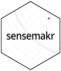

<!-- README.md is generated from README.Rmd. Please edit that file -->

```{r, echo = FALSE}
knitr::opts_chunk$set(
  collapse = TRUE,
  fig.align = "center",
  comment = "#>",
  fig.path = "man/figures/figures-"
)
```

# sensemakr: Sensitivity Analysis Tools for OLS 

<!-- badges: start -->
[](https://travis-ci.org/carloscinelli/sensemakr) 
[](https://ci.appveyor.com/project/carloscinelli/sensemakr)
[](https://CRAN.R-project.org/package=sensemakr)
[](https://codecov.io/github/carloscinelli/sensemakr?branch=master)
[](https://cran.r-project.org/package=sensemakr)
<!-- badges: end -->

`sensemakr` implements a suite of sensitivity analysis tools  that extends the traditional omitted variable bias framework and makes it easier  to understand the impact of omitted variables in regression models, as discussed in [Cinelli, C. and Hazlett, C. (2020) "Making Sense of Sensitivity: Extending Omitted Variable Bias." Journal of the Royal Statistical Society, Series B (Statistical Methodology).]( https://doi.org/10.1111/rssb.12348) 

# News

- Watch the [useR! 2020 presentation](https://www.youtube.com/watch?v=p3dfHj6ki68) for a quick introduction on sensemakr.

- Check out the [software paper preprint](https://www.researchgate.net/publication/340965014_sensemakr_Sensitivity_Analysis_Tools_for_OLS_in_R_and_Stata)!

- Check out the new [Stata version](https://github.com/resonance1/sensemakr-stata) of the package!

- Check out the Robustness Value Shiny App at: https://carloscinelli.shinyapps.io/robustness_value/

- Check out the [package website](http://carloscinelli.com/sensemakr/)!


# Details

For theoretical details, [please see the JRSS-B paper](https://www.researchgate.net/publication/322509816_Making_Sense_of_Sensitivity_Extending_Omitted_Variable_Bias). 


For a practical introduction, [please see the software paper](https://www.researchgate.net/publication/340965014_sensemakr_Sensitivity_Analysis_Tools_for_OLS_in_R_and_Stata) or [see the package vignettes](http://carloscinelli.com/sensemakr/articles/sensemakr.html). 

For a quick start, watch the 15 min tutorial on sensitivity analysis using sensemakr prepared for useR! 2020:

<iframe width="560" height="315" src="https://www.youtube.com/embed/p3dfHj6ki68" frameborder="0" allow="accelerometer; autoplay; encrypted-media; gyroscope; picture-in-picture" allowfullscreen></iframe>


# CRAN

To install the current CRAN version run:

```{r, eval = FALSE}
install.packages("sensemakr")
```


# Development version

To install the development version on GitHub make sure you have the package `devtools` installed.

```{r, eval=FALSE}
# install.packages("devtools") 
devtools::install_github("chadhazlett/sensemakr")
```

# Citation

Please use the following citations:

- [Cinelli, C., & Hazlett, C. (2020). "Making sense of sensitivity: Extending omitted variable bias." Journal of the Royal Statistical Society: Series B (Statistical Methodology), 82(1), 39-67.](https://doi.org/10.1111/rssb.12348)

- [Cinelli, C., & Ferwerda, J., & Hazlett, C. (2020). "sensemakr: Sensitivity Analysis Tools for OLS in R and Stata."](https://www.researchgate.net/publication/340965014_sensemakr_Sensitivity_Analysis_Tools_for_OLS_in_R_and_Stata)

# Basic usage


```{r basic-usage, fig.align='center', collapse=T, dpi=300}
# loads package
library(sensemakr)

# loads dataset
data("darfur")

# runs regression model
model <- lm(peacefactor ~ directlyharmed + age + farmer_dar + herder_dar +
                         pastvoted + hhsize_darfur + female + village, data = darfur)

# runs sensemakr for sensitivity analysis
sensitivity <- sensemakr(model = model, 
                         treatment = "directlyharmed",
                         benchmark_covariates = "female",
                         kd = 1:3)

# short description of results
sensitivity

# long description of results
summary(sensitivity)

# plot bias contour of point estimate
plot(sensitivity)

# plot bias contour of t-value
plot(sensitivity, sensitivity.of = "t-value")

# plot extreme scenario
plot(sensitivity, type = "extreme")

# latex code for sensitivity table
ovb_minimal_reporting(sensitivity)
```


