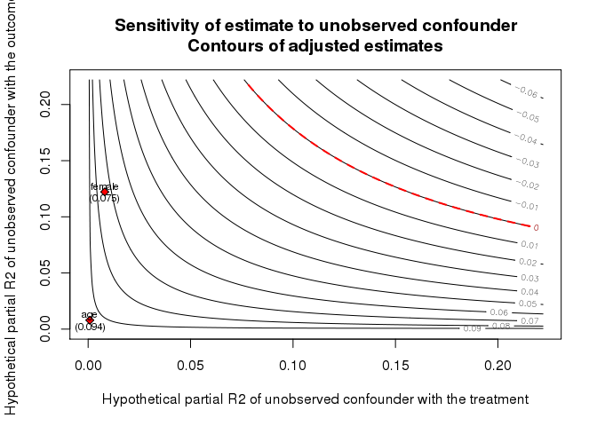

<!-- README.md is generated from README.Rmd. Please edit that file -->
[](https://travis-ci.org/chadhazlett/sensemakr)

sensemakr
=========

Practitioners of causal inference have a wide variety of tools to assess the influence of observed confounders on their effect estimates. sensemakr makes it easy to assess the influence of *un*observed confounders, bound effect estimates, and visually plot confounding.

The package defines a custom `sensemakr` class that enables plot and print methods so that the user can make sense of unobserved confounding.

Installation
------------

You can install sensemakr from github with:

``` r
# install.packages("devtools")
devtools::install_github("chadhazlett/sensemakr")
```

Example
-------

Below is a basic example of the functionality in the sensemakr package

``` r
library(sensemakr)

data(darfur)

sense.out = sensemakr(peacefactor ~ directlyharmed + age + female + village,
                      data = darfur,
                      treatment = "directlyharmed",
                      benchmark = "female")

plot(sense.out, multipliers_y = 1)
```


