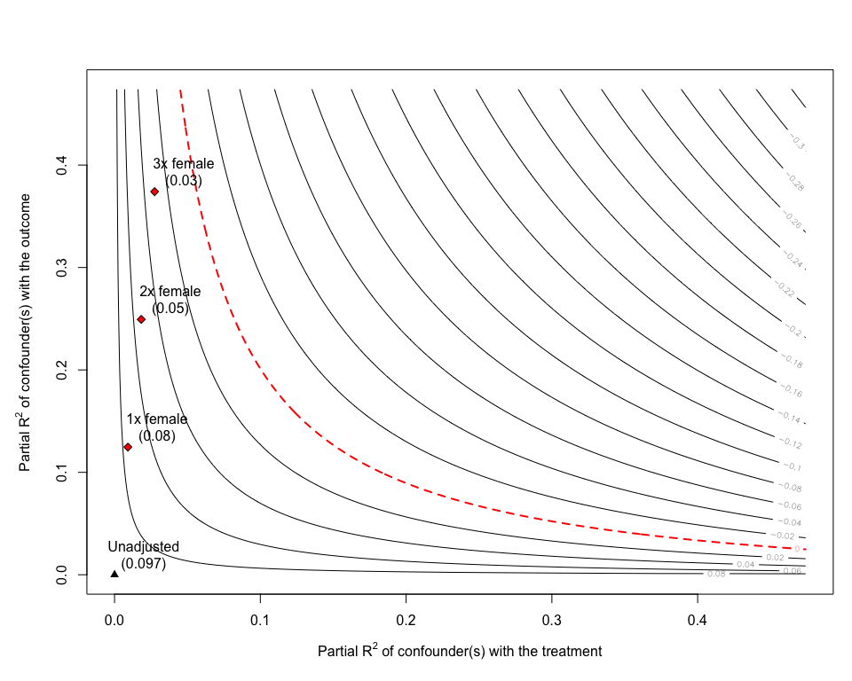

<!-- README.md is generated from README.Rmd. Please edit that file -->

## sensemakr 

[](https://travis-ci.org/chadhazlett/sensemakr)
[](https://ci.appveyor.com/project/carloscinelli/sensemakr)
[](https://cran.r-project.org/package=sensemakr)
[](https://codecov.io/github/chadhazlett/sensemakr?branch=master)


# News

Check out the Robustness Value Shiny App at:
<https://carloscinelli.shinyapps.io/robustness_value/>

# Details

For theoretical details, [please see the full
paper](https://www.researchgate.net/publication/322509816_Making_Sense_of_Sensitivity_Extending_Omitted_Variable_Bias).
A step-by-step hands on vignette will be ready soon.

# CRAN

The package has just been released on CRAN\! To install the current CRAN
version run:

``` r
install.packages("sensemakr")
```

# How to install the development version from GitHub

To install the development version on GitHub make sure you have the
package `devtools` installed.

``` r
# install.packages("devtools") 
devtools::install_github("chadhazlett/sensemakr")
```

# Basic usage

``` r
# loads package
library(sensemakr)
#> See details in:
#> Carlos Cinelli and Chad Hazlett (2018). Making Sense of Sensitivity: Extending Omitted Variable Bias.

# loads dataset
data("darfur")

# runs regression model
model <- lm(peacefactor ~ directlyharmed + age + farmer_dar + herder_dar +
                         pastvoted + hhsize_darfur + female + village, data = darfur)

# runs sensemakr for sensitivity analysis
sensitivity <- sensemakr(model, treatment = "directlyharmed",
                               benchmark_covariates = "female",
                               kd = 1:3)
# short description of results
sensitivity
#> Sensitivity Analysis to Unobserved Confounding
#> 
#> Model Formula: peacefactor ~ directlyharmed + age + farmer_dar + herder_dar + 
#>     pastvoted + hhsize_darfur + female + village
#> 
#> Unadjusted Estimates of ' directlyharmed ':
#>   Coef. estimate: 0.09732 
#>   Standard Error: 0.02326 
#>   t-value: 4.18445 
#> 
#> Sensitivity Statistics:
#>   Partial R2 of treatment with outcome: 0.02187 
#>   Robustness Value, q = 1 : 0.13878 
#>   Robustness Value, q = 1 alpha = 0.05 : 0.07626 
#> 
#> For more information, check summary.

# long description of results
summary(sensitivity)
#> Sensitivity Analysis to Unobserved Confounding
#> 
#> Model Formula: peacefactor ~ directlyharmed + age + farmer_dar + herder_dar + 
#>     pastvoted + hhsize_darfur + female + village
#> 
#> Unadjusted Estimates of 'directlyharmed': 
#>   Coef. estimate: 0.0973 
#>   Standard Error: 0.0233 
#>   t-value: 4.1844 
#> 
#> Sensitivity Statistics:
#>   Partial R2 of treatment with outcome: 0.0219 
#>   Robustness Value, q = 1: 0.1388 
#>   Robustness Value, q = 1, alpha = 0.05: 0.0763 
#> 
#> Verbal interpretation of sensitivity statistics:
#> 
#> -- Partial R2 of the treatment with the outcome: an extreme confounder (orthogonal to the covariates) that explains 100% of the residual variance of the outcome, would need to explain at least 2.19% of the residual variance of the treatment to fully account for the observed estimated effect.
#> 
#> -- Robustness Value, q = 1: unobserved confounders (orthogonal to the covariates) that explain more than 13.88% of the residual variance of both the treatment and the outcome are strong enough to bring the point estimate to 0 (a bias of 100% of the original estimate). Conversely, unobserved confounders that do not explain more than 13.88% of the residual variance of both the treatment and the outcome are not strong enough to bring the point estimate to 0.
#> 
#> -- Robustness Value, q = 1, alpha = 0.05: unobserved confounders (orthogonal to the covariates) that explain more than 7.63% of the residual variance of both the treatment and the outcome are strong enough to bring the estimate to a range where it is no longer 'statistically different' from 0 (a bias of 100% of the original estimate), at the significance level of alpha = 0.05. Conversely, unobserved confounders that do not explain more than 7.63% of the residual variance of both the treatment and the outcome are not strong enough to bring the estimate to a range where it is no longer 'statistically different' from 0, at the significance level of alpha = 0.05.
#> 
#> Bounds on omitted varible bias:
#>  Bound Label R2dz.x R2yz.dx Adjusted Estimate Adjusted Se Adjusted T
#>    1x female 0.0092  0.1246            0.0752      0.0219     3.4389
#>    2x female 0.0183  0.2493            0.0529      0.0204     2.6002
#>    3x female 0.0275  0.3741            0.0304      0.0187     1.6281
#>  Adjusted Lower CI Adjusted Upper CI
#>             0.0323            0.1182
#>             0.0130            0.0929
#>            -0.0063            0.0670

# plot bias contour of point estimate
plot(sensitivity)
```

<!-- -->

``` r

# plot bias contour of t-value
plot(sensitivity, sensitivity.of = "t-value")
```

<!-- -->

``` r

# plot extreme scenario
plot(sensitivity, type = "extreme", cex.legend = 1)
```

<!-- -->

``` r

# latex code for sensitivity table
ovb_minimal_reporting(sensitivity)
#> \begin{table}[!h]
#> \centering
#> \begin{tabular}{lrrrrrr}
#> \multicolumn{7}{c}{Outcome: \textit{peacefactor}} \\
#> \hline \hline 
#> Treatment: & Est. & S.E. & t-value & $R^2_{Y \sim D |{\bf X}}$ & $RV_{q = 1}$ & $RV_{q = 1, \alpha = 0.05}$  \\ 
#> \hline 
#> \textit{directlyharmed} & 0.097 & 0.023 & 4.184 & 2.2\% & 13.9\% & 7.6\% \\ 
#> \hline 
#> df = 783 & & \multicolumn{5}{r}{ \small \textit{Bound (1x female)}: $R^2_{Y\sim Z| {\bf X}, D}$ = 12.5\%, $R^2_{D\sim Z| {\bf X} }$ = 0.9\%} \\
#> \end{tabular}
#> \end{table}
```
