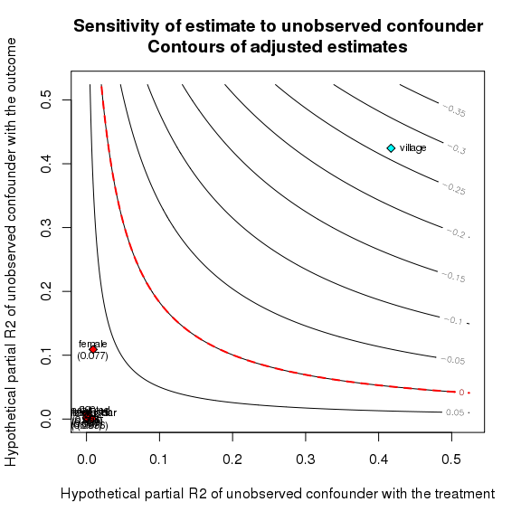
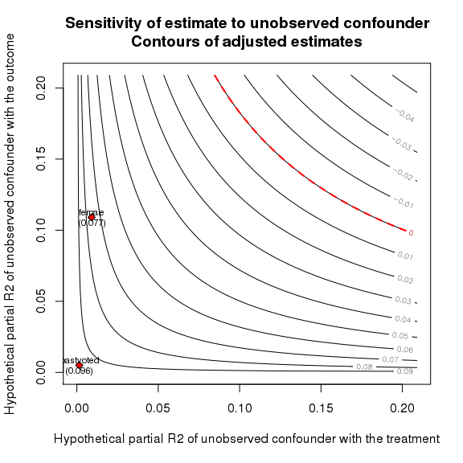
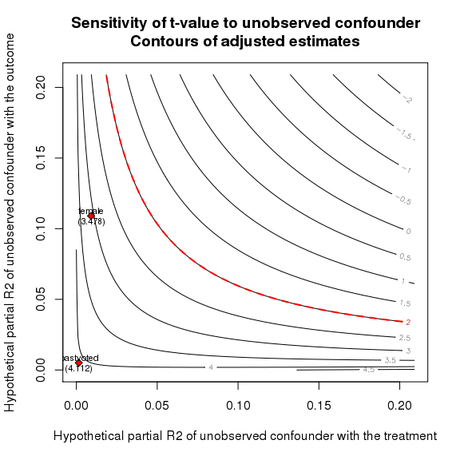
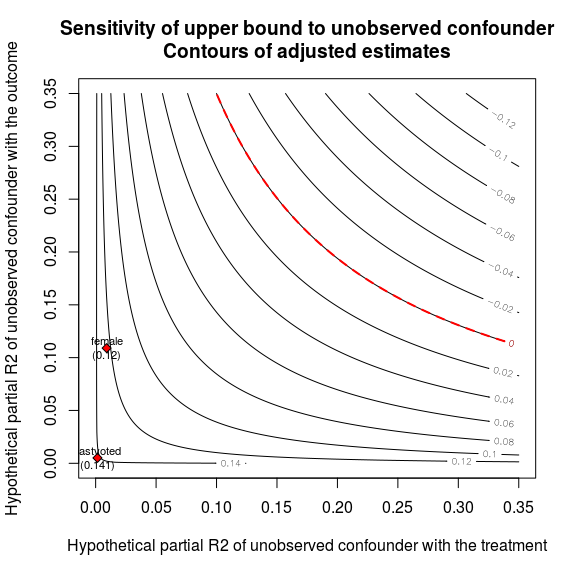
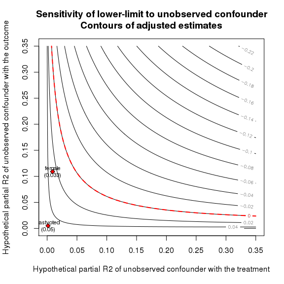
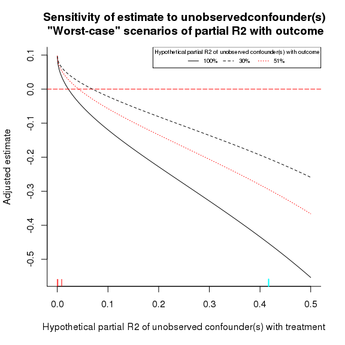
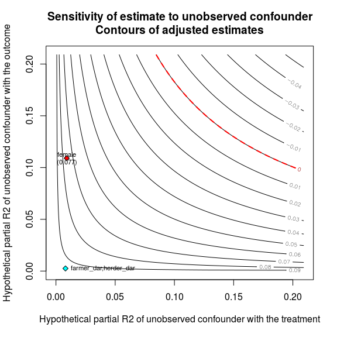

# The `sensemakr` Vignette
Michael Tzen, Chad Hazlett, Carlos Cinelli  
`r format(Sys.time(), '%d %B, %Y')`  


# Background
Welcome to the vignette for `sensemakr`.  This document briefly describes the basic idea and method for the procedure, then moves on to basic usage, followed by more customized usage in the following sections. 

## Introduction to `sensemakr`

The `sensemakr` package simply builds upon and makes more accessible a brand of sensitivity analysis closesly related to well known concepts of \textit{omitted variable bias.} One has a linear outcome moel, and imagines that certain important confounders might be missing from it.  Given what \textit{is} in the model, what would need to be the properties of an omitted confounder to have biased your estimate by a certain amount (or as we put it, to imply an adjusted estimate that differs from the actual by that amount)?  In addition to changing the point estimate, such a confounder would change the standard errors, t-values, p-values, etc., making the adjusted versions of these quantities of interest as well.  

The challenge is to characterize a hypothesized troublesome confounder in such a way that enables the user to ask "is this an unobserved confounder that could likely exist in my circumstance?"  This depends heavily on the research design and information about the treatment assignment process. Sensitivity analysis is only a tool for elaborating our discussion of what might have gone wrong in a given observational analysis -- not for tell us that nothing has gone wrong. 

Confounders are characterized by their relationship to the treatment and to the outcome. Our main focus is on describing hypothesized confounders by the partial $R^2$ values relating them to the treatment and outcome. This is a more universal value than other parameters, as it does not depend on the scale of the hypothesized confounder, for example. Other advantages of this approach are described in the paper.  

A simple sensitivity analysis can be done that produces a two-dimensional plot in which one axis shows hypothesized values of the partial $R^2$ between a confounder and the treatment, and the other axis shows hypothesized values of the partial $R^2$ between a confounder and the outcome. Contour lines can be drawn in this two-dimensional space and labeled to indicate either the bias on each line, or the "adjusted treatment effect estimate".  While this is technically straightforward, it provides users with little insight: yes, a confounder with certain partial $R^2$ values would change the estimate by a certain amount.  But how can we use this to draw conclusinos about the robustness of real results against such confounders? In short, how can we assess the likelihood that a confounder that has a troubling impact as described by such a plot could have existed in our analysis?

To help investigators make the leap from the sensitivity analysis itself to an understanding of whether a given troublesome type of confounder is likely to exist, we provide two main modes of interpretation: \textit{benchmarking} and \textit{worst-case scenarios}.   In benchmarking we ask: for a given observed variable, what if an unobserved confounder existed with an equally strong relationship to the treatment and the outcome? Would such a confounder be troubling? Note that this is subtly different from merely leaving out the observable in question, since leaving it out would also effect the error variance.  Here we "leave the observable in"  but ask what would happen had unobservables with similar properties existed.  The value of benchmarking is that users may have an idea of how well they have explained the treatment or the outcome, and which covariates are already strong predictors.  If for example one knows that the treatment assignment process was largely random but that where it wasn't, a particular observed covariate was certainly the most important, then it may be possible to rule out unobserved covariates that have 2, 10, or 100 times as strong a relationship to the treatment.  Similarly if the outcome is known to be strongly driven by a few observables with little room for other explanatory factors, then the user may rule out the existence of confounders that are 10 times more strongly related to the outcome than the observables are as a group (`sensemakr` can also treat observables collectively in groups for such purposes.)

Benchmark analyses may be presented numerically or graphically. They may also be used to contemplate not only how point estimates change given a hypothesized confounder, but how $t$-values and $p$-values change, for example.  We demonstrate these below.  `sensemakr` also outputs natural language interpretations of benchmark comparisons. 

The second mode of interpretation we use is "worst-case scenarios". The fundmantal inuition is that the error term in a fitted linear model contains all the variation in $Y$ not already explained by covariates, $X$, and treatment $D$. What if nature is cruel, and all that remaining variation is in fact attribtuable to a confounder? In stating this, we have specified that the partial $R^2$ of the confounder with the outcome, given $X$ and $D$, is $1$. The user may alternatively think this is too harsh, and that the partial $R^2$ of the confounder hiding in the residual could be at most $0.30$, for exampl. We can know ask how such a confounder would need to relate to the treatment, in terms of partial $R^2$ as well, in order to change our substantive conclusions by a given amount.  Users may have a research design such that they know a partial $R^2$ with the treatment of even 0.10 is unlikely, because they have already accounted for all plausible systematic sources of treatment assignment. Or, they may have less substantive knowledge, and can only make the weaker claim that it would be very surprising for any unobservable to explain some large portinon of the treatment assignment, making the sensitivity analysis less optimistic. Thus, users are better off with more information and better research designs in these worst-case scenarios. 

## Running Example: Natural experiment on the effects of violence on attitudes among Darfurian refugees in Chad. 

Before turning to usage, we introduce the data that will be used. Throughout this vingette, we will use the `Darfur` data to explore these operations. The treatment is exposure to violence, `directlyharmed` a binary indicator for those physically injured during attacks in Darfur.  The outcome is a scale measuring pro-peace attitudes, `peacefactor`. 

We load the data:


```r
library(sensemakr)
data("darfur")
```

# Basic Usage

## Installation

The latest version of `sensemakr` can be installed by:


```r
devtools::install_github("chadhazlett/sensemakr", build_vignettes = TRUE)
```

We begin by showing basic functionality with the features we expect most users will use most of the time. 

The basic workflow is as follows: 

1) Fit a linear outcome model via `lm.out=lm()`. This should have your treatment and (pre-treatment) covariates on the right hand side.   

2) Create a sensemakr object, `sense.out=sensemakr(lm.out)`, which contains useful sensitivity quantitites.

3) Explore the results by use of `plot(sense.out)` and `summary(sense.out)`, or directly by functions these methods call upon.

The first step is running the linear outcome model: 


```r
lm.out  <- lm(peacefactor ~ directlyharmed + age + farmer_dar + herder_dar +
               pastvoted + hhsize_darfur + female + village, data = darfur)
```

The key covariates here for identification purposes is `village`, a factor with 690 levels indicating the village participants are from. Only conditionally upon village do we expect that `directlyharmed` is "as-if randomized". The other covariate required for identification is `female`, a binary indicator for women. The other covariates are included as auxilliary controls, but mainly for purposes of the sensitivity analysis. 

The second step is to run `sensemakr` on the `lm` object. At defaults this is simply,


```r
sense.out <- sensemakr(model=lm.out, treatment="directlyharmed")
```

The `sensemakr` object, `sense.out`, contains a variety of useful quantities, including `sensemakr$benchmarks`, which we will explore below. In common use cases, however, investigators would not inspect this directly but would turn to the `plot` and `summary` methods.  

We turn first to the `summary` method to gain substantive insight into the sensitivity analysis itself.

## Summary and Interpretation

Sensitivity analyses describe the type of confounders that would change our conclusions about an analysis. The challenge is in understanding how credibly such a confounder can be ruled out.  The summary methods provide ample interpretive information, describing the sensitivity results in several ways to increase the odds that investigators can meaningfully evaluate whether the types of confounders describes are likely to exist. A second purpose of providing numerous, verbose descriptions is to provide clear and precise language that investigators can refer to and even cite directly to minimize misunderstandings.

The user simply applies the summary method to the `sensemakr` object,

```r
summary(sense.out)
```

```
## Sensitivity Analysis
## 
## Model: peacefactor ~ directlyharmed + age + farmer_dar + herder_dar + pastvoted + hhsize_darfur + female + village 
## 
## Outcome: peacefactor 
## Treatment: directlyharmed 
## Unadjusted Treatment Effect: 0.097 
## 
## *** SENSITIVITY TO UNOBSERVED CONFOUNDERS ***
## 
## ### Worst Case Scenarios ###
## 
## Considering the extreme scenarios of unobserved confounders explaining 100%, 25% of the residual variance of the outcome, they would have to, respectively, explain at least 2.19%, 8.21% of the treatment assignment to reduce the treatment effect in 100%.
## 
## ### Benchmarking ###
## 
## ---Using the covariate most strongly associated with the treatment assignment as a benchmark---
## 
## An unobserved confounder explaining as much of the treatment as 'female' (0.009)  would be able to cause at most a bias of 0.062 with an adjusted treatment effect of 0.035 in the extreme case where the confouder explains all the residual variance of the outcome (R2y = 1).
## 
## ---Using the covariate most strongly associated with the outcome as a benchmark---
## 
## An unobserved confounder as associated with the outcome as 'female' (R2y = 0.109)  would have to be at least 18.7 times as strongly associated with the treatment (reaching R2d = 0.17) in order to reduce the treatment effect by 100%
```

After recapitulating the model, the outcome variable, the treatment variable, and the (unadjusted) treatment effect estimate, the output goes on to describe and interpret the results in like of (i) worst case scenarios, and (ii) benchmark comparisons.

### Worst-case scenario summary:
The \textit{worst-case scenario} considers the sensitivity of results based on the unexplained variance. The worst case is one in which \textit{all} unexplained variation in the outcome belongs to an omitted confounder. How strongly would such an omitted variable need to be associated with the treatment in order to reduce the treatment effect estimate by some proportion `q`, such as q=0.50 (50\%) or q=1 (100\%)? By default, $q=1$, and so we are asking what would be necessary to imply the effect estimate would be zero had the hypothesized confounder been observed and included.

This worst-case scenario analysis can also be generated by a direct call to `worstcaseinterpret()`. Here we demonstrate this, changing both the value of `q` and the scenarios that are considered:


```r
worstcaseinterpret(sense.out, scenarios=c(.1,.3), q=.5)
```

```
## Considering the extreme scenarios of unobserved confounders explaining 10%, 30% of the residual variance of the outcome, they would have to, respectively, explain at least 5.29%, 1.83% of the treatment assignment to reduce the treatment effect in 50%.
```

### Benchmarking summary
The summary command above, `summary(sense.out)`, also generates interpretational text related to benchark comparisons. While the benchmark plots (below) provide additional information, these summaries describe two conclusions we expect are often of interest. 

The first block of text uses the covariate most strongly associated with the \textit{treatment} (by partial $R^2$) as the point of interest.  It supposes that a confounder exists that is equally associated with the treatment (in it's own partial $R^2$, in a model that still includes the original covariates). It then makes a worst-case assumption that such a confounder explains all of the residual outcome variance (having a partial $R^2$ of 1 with the outcome), and asks what bias would be obtained.  It is thus a kind of worst-case analysis as above, but where the hypothesized relationship of the confounder to the treatment is benchmarked, using the value of the covariate most strongly related to treatment as an example. 

The second block of text uses the covariate most strongly associated with the \textit{outcome} as a benchmark. Rather than a worst-case analysis, it instead imagines a confounder with the same relationship to the outcome as this benchmark, and asks how many times more strongly it would have to be related to the outcome than this benchmark is in order to change our adjusted answer by proportion of $q$.

Note that the benchmark interpretations provided in the printout of `summary` really come from `interpret()`, which users can also call directly. 

## Basic Plotting: 
There are two plot types: (i) contourplots with benchmarks, which can take the form of point estimates, t-statistics, or lower- and upper-limits of confidence intervals, and (ii) worstcase plots. 

### Contourplots
As contourplots are the default, we begin there: 

```r
plot(sense.out)
```

<!-- -->

As shown, this produces a two-dimensional contour plot. The contour lines give the value of the adjusted treatment effect estimate for each pair of partial $R^2$ parameters of the hypothesized confounder. 

These plot also by definition show each of the covariates included as a benchmark. The majority of these are small red diamonds, which in this case appear tightly clusteres in the lower-left corner.  This indicates that each has a weak relationship with both the treatment and the outcome.  The proper interpretatin of these benchmark points is that "a confounder with the same partial $R^2_D$ and partial $R^2_Y$ as a given covariate would imply an adjusted treatment effect indicated by that covariates benchmark point on the plot."  It is not quite true to say that these benchmarks indicate the adjusted effect "had that covariate been left out", because the quantities are computed as if the covariates included in the model remain in the model.

Note that "village" is cyan rather than red. This is because it represents a whole group of covariates -- the different levels of the factor variable `village`.  As described in the paper, for variables that occupy multiple columns of the design matrix (or any arbitrary grouping of variables treated as one), the sensitivity parameters computed a worst-case bounds. In this case, `village` was treated as a group by default, because it entered the model as a factor.  See advanced usage below for controlling the construction of groups and their display.

Because the clustering of benchmark points in the lower left makes it difficult to see individual points, the user may wish to plot fewer benchmarks. This can be done by specifying which to plot, as in


```r
plot(sense.out, showvars = list("pastvoted","female"))
```

<!-- -->

Finally, by default these contourplots show adjusted point estimates. This is equivalent to setting the `countour` argument to its default value of `estimate`. However `contour` can also be set to `t-value`, `lower-limit`, or `upper-limit` to show results for the t-statistic and the resulting lower and upper limits of 95\% confidence intervals respectively.  For example, we can inspect the t-values and related benchmarks across values of the sensitivity parameters by


```r
plot(sense.out, showvars = list("pastvoted","female"), contour="t-value")
```

<!-- -->

For this plot, the contour line that is emphasized is at $t=1.96$ rather than zero: we are interested in where an estimate would become statistically indistinguishable from zero. Because the standard errors change as the hypothesized confounder changes, this requires more than computing a critical value from the original analysis and seeing when an adjusted estimate falls below it.


An alternative way of incorporating information about how a hypothesized confounder revises the standard error is to focus on the upper- or lower-limits of a 95\% confidence interval around the point estimate. Both can be called as follows, which also show how the `lim` argument can be used to control the maximum $R^2$ used in the plots,


```r
plot(sense.out, showvars = list("pastvoted","female"), contour="upper-limit", lim=.35)
```

<!-- -->

```r
plot(sense.out, showvars = list("pastvoted","female"), contour="lower-limit", lim=.35)
```

<!-- -->

### Worst-case plots

The second main plot type is the worst-case plot:


```r
plot(sense.out, type="worst-case",lim=0.5)
```

<!-- -->
Here the dashed lines show different scenarios. The most severe is the solid line, for which the entire residual from the model is hypohtesized to be a confounder (partial $R^2_Y=1$). One can then follow this line to see where it cross a designated value of the adjusted estimate, such as $0$, which we mark for convenience.  The point at which the line crosses zero correspondons to approximately 0.02 on the horizontal axis. This indicated that an unobserved confounder with partial $R^2_Y=1$, i.e. the entire residual, would need only have a partial $R^2_D$ of about 2\% in order to change the sign of the effect estimate. 

The tick marks on the horizontal axis show benchmarks -- the partial $R^2_D$ values of observed covariates, for comparison. In this case, we are fortunate that even assuming a confounder with $R^2_Y=1$, though it's $R^2_D$ would need to be only 2\% to eliminate the effect, that is approximately twice the $R^2_D$ of any observable.  Given the research design, we know that the treatment actually consists of injuries that occured during indiscriminate violence. As argued in XXX, the nature of the violence makes it difficult to imagine unoberved confounders predict the assignment of violence more strongly than observables such as  `female`.  This suggests that the result is fairly robust. 

A more conservative analysis would not assume a confounder with partial $R^2_Y=1$, but perhaps 30\%, or perhaps the same $R^2_Y$ as observed for the covariate most strongly predictive of the outcome (51\% in this case, also shown as a line.)  By worst-case plot will always show a line corresponding to the largest observed $R^2_Y$ (51\% in this case).  The remaining lines are determined by the option `scenarios`, which defaults to 100\% and 30\% (i.e. `scenarios=c(1,.3)`) as shown here.

## Directly accessing results

The quantities most relevant to these analyses can be extracted directly from the `sensemakr` object. 

Within this object, `info` contains information from the `lm` object. `treat.stats` contains information about the treatment effect and its standard error and degrees of freedom, all of which are important to sensitivity calculations,


```r
sense.out$treat.stats
```

```
##            treat   estimate         se  df
## 1 directlyharmed 0.09731582 0.02325654 783
```

More interestingly, `benchmarks` contain sensitivity parameters associated with each benchmark. A vareity of parameter types are given for each benchmark, each stored in a separate matrix


```r
ls(sense.out$benchmarks)
```

```
## [1] "benchmark_dropallvar" "benchmark_eachvar"    "benchmark_group"     
## [4] "benchmark_masked"     "benchmark_natural"
```

The `benchmark_dropallvar` list element contains useful information for computing sensitivity parameters, but the quantities of usual interest will be stored in `benchmark_eachvar` and `benchmark_masked`. Both contain similar information, but when grouped variables (such as `village`) are included in the model, looking at `benchmark_masked` conveniently masks the grouped variables (620 separate indicators in this case):


```r
round(sense.out$benchmarks$benchmark_masked,4)
```

```
##                  r2y    r2d bias_r2 adj_est_r2 adj_se_r2 adj_t_r2
## female        0.1090 0.0091  0.0206     0.0767    0.0221   3.4779
## age           0.0080 0.0011  0.0019     0.0954    0.0232   4.1123
## pastvoted     0.0051 0.0015  0.0018     0.0955    0.0232   4.1123
## herder_dar    0.0003 0.0079  0.0009     0.0964    0.0234   4.1263
## hhsize_darfur 0.0005 0.0002  0.0002     0.0971    0.0233   4.1741
## farmer_dar    0.0024 0.0000  0.0001     0.0972    0.0232   4.1838
```

The columns `r2y` and `r2d` give the partial `R^2` with the outcome (`y`) and treatment (`d`) respectively.  The `bias_r2` gives the bias that would be caused by a confounder with the corresponding `r2y` and `r2d`. The adjusted estimated due to this bias -- simply the original estimate minus the proposed bias -- is `adj_est_r2`.  Finally, the adjusted `adj_se_r2` and `adj_t_r2` gives the standard error and t-statistic after adjusting for a hypothetical confounder with the proposed characteristics.  

Finally, the parameters for the masked (grouped) variables -- the `village` dummies in this case -- are stored in `benchmark_group`:


```r
sense.out$benchmarks$benchmark_group
```

```
##               r2y       r2d  bias_r2 adj_est_r2
## village 0.4242888 0.4169266 0.358447 -0.2611312
```


## User Specified Groups as Benchmarks

In the above examples, the only variables grouped together were the village indicators which derived from a single factor variable and were thus grouped by default.  In other cases, users may wish to group variables together manually.  The sensitivity parameters associated with such a group imply a level of bias associated with that group of variables.  This level of bias is actually an over-estimate of the bias the would be caused by leaving out these variables themselves, but it is the bias that would be caused if an unobseved confounder has the same partial $R^2$ values as this collective group.

Custom groupings can be constructed by specifying them during the `sensemakr()` call using the optional `group_list` argument, which expects a list of character vectors. For example, two different livelihood indicators, `farmer_dar`, and `herder_dar` can be grouped together:


```r
sense.grp.out = sensemakr(lm.out, treatment="directlyharmed",
                         group_list = list(c("farmer_dar","herder_dar")))
```

The resulting group variables will be named as the first variable name followed by the second variable name with a comma in between, i.e. `farmer_dar,herder_dar`.  We can see the resulting benchmarks for this grouped variable (and `village`, which remains grouped) as in,


```r
sense.grp.out$benchmarks$benchmark_group
```

```
##                              r2y         r2d    bias_r2  adj_est_r2
## farmer_dar,herder_dar 0.00250921 0.008025826 0.00293217  0.09438365
## village               0.42428884 0.416926607 0.35844699 -0.26113117
```

```r
plot(sense.grp.out, showvars=list("farmer_dar,herder_dar", "female"))
```

<!-- -->

