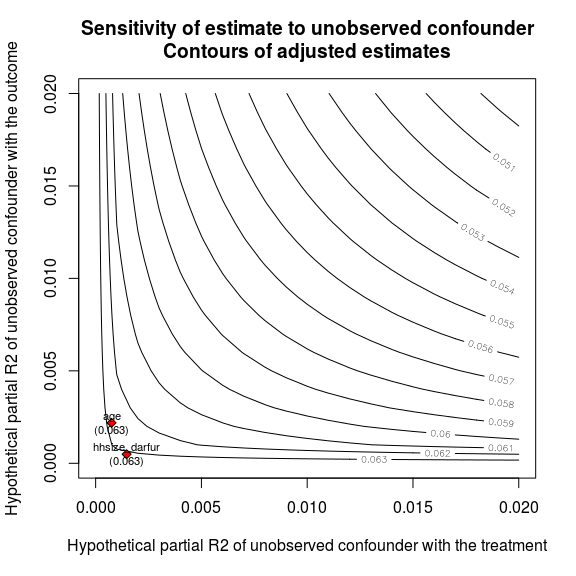
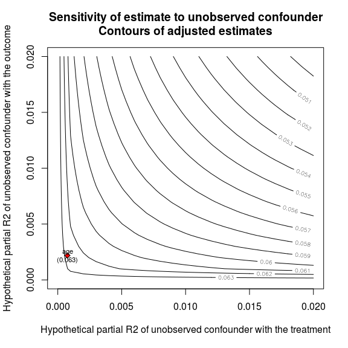
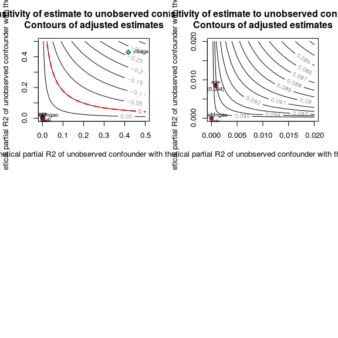
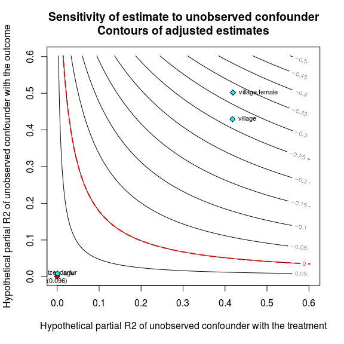
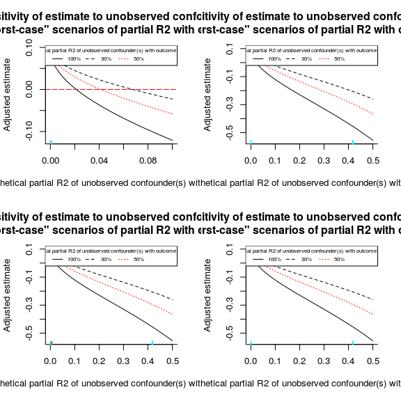

# The sensemakr vignette
Michael Tzen, Chad Hazlett, Carlos Cinelli  
`r Sys.Date()`  

# Setup


```r
knitr::opts_chunk$set(echo = TRUE,
                      fig.width=6,
                      fig.height=6)
```

## Install ‘sensemakr’


```r
# devtools::install_github("chadhazlett/sensemakr")

# setwd("~/projects/sensemakr_fin/sensemakr/")

# devtools::build_vignettes() 
```

## Darfur Data Example


```r
library(sensemakr)
data("darfur")
```


## The 3 Steps

1) Fit a linear model via `lm()`
2) Compute sensitivity quantitites via `sensemakr()`
3) Plot quantities via `plot()`

We will show 3 examples using the darfur data. The examples sequentially expose increasing amounts of customization that a user can run for their sensitivity analysis. We will provide examples of continuous benchmarks, categorical benchmarks, and user supplied benchmark groups.


```r
summary(darfur)
```

```
##    wouldvote        peacefactor.V1    FormerEnemiesPeace PeaceWithJJIndiv
##  Min.   :0.0000   Min.   :0.0000000   Min.   :0.0000     Min.   :0.0000  
##  1st Qu.:0.0000   1st Qu.:0.0000000   1st Qu.:0.0000     1st Qu.:0.0000  
##  Median :0.0000   Median :0.2020084   Median :0.0000     Median :0.0000  
##  Mean   :0.4099   Mean   :0.3235865   Mean   :0.3879     Mean   :0.1724  
##  3rd Qu.:1.0000   3rd Qu.:0.5929100   3rd Qu.:1.0000     3rd Qu.:0.0000  
##  Max.   :1.0000   Max.   :1.0000000   Max.   :1.0000     Max.   :1.0000  
##                                                                          
##  PeaceWithJJTribes GoSsoldier_execute directlyharmed        age        
##  Min.   :0.0000    Min.   :0.0000     Min.   :0.0000   Min.   : 18.00  
##  1st Qu.:0.0000    1st Qu.:0.0000     1st Qu.:0.0000   1st Qu.: 26.00  
##  Median :0.0000    Median :1.0000     Median :0.0000   Median : 35.00  
##  Mean   :0.3276    Mean   :0.6223     Mean   :0.4146   Mean   : 37.43  
##  3rd Qu.:1.0000    3rd Qu.:1.0000     3rd Qu.:1.0000   3rd Qu.: 45.00  
##  Max.   :1.0000    Max.   :1.0000     Max.   :1.0000   Max.   :100.00  
##                                                                        
##    farmer_dar       herder_dar       pastvoted      hhsize_darfur   
##  Min.   :0.0000   Min.   :0.0000   Min.   :0.0000   Min.   : 1.000  
##  1st Qu.:1.0000   1st Qu.:0.0000   1st Qu.:0.0000   1st Qu.: 6.000  
##  Median :1.0000   Median :0.0000   Median :1.0000   Median : 8.000  
##  Mean   :0.8237   Mean   :0.1489   Mean   :0.6434   Mean   : 9.082  
##  3rd Qu.:1.0000   3rd Qu.:0.0000   3rd Qu.:1.0000   3rd Qu.:11.000  
##  Max.   :1.0000   Max.   :1.0000   Max.   :1.0000   Max.   :60.000  
##                                                                     
##       village        female      
##  Kornoy   : 91   Min.   :0.0000  
##  Silea    : 58   1st Qu.:0.0000  
##  Abu Gamra: 48   Median :0.0000  
##  Misteri  : 46   Mean   :0.4561  
##  Furawiya : 40   3rd Qu.:1.0000  
##  Kabar    : 35   Max.   :1.0000  
##  (Other)  :958
```

In our examples below, the treatment is `directlyharmed` and the outcome is `peacefactor`. 

# Continuous Benchmarks

## Fit

In the outcome model, there are two continuous covariates, `age` and `hhsize_darfur`.


```r
model_cntns = lm(data = darfur,
                 peacefactor ~ directlyharmed +
                   age + hhsize_darfur)
```

## Compute


```r
sense_cntns = sensemakr(model=model_cntns,
                        treatment="directlyharmed")

str(sense_cntns$benchmarks,max.level = 1)
```

```
## List of 5
##  $ benchmark_dropallvar:'data.frame':	1 obs. of  5 variables:
##  $ benchmark_eachvar   :'data.frame':	2 obs. of  7 variables:
##  $ benchmark_group     :'data.frame':	0 obs. of  2 variables:
##  $ benchmark_masked    :'data.frame':	2 obs. of  7 variables:
##  $ benchmark_natural   :'data.frame':	2 obs. of  5 variables:
```

```r
class(sense_cntns)
```

```
## [1] "sensemade"
```

## Plot

```r
plot(sense_cntns,lim=0.02)
```

<!-- -->

### Show specific benchmark points from an explicit list


```r
plot(sense_cntns,showvars=list('age','hhsize_darfur'),lim=0.02)
```

<!-- -->

```r
plot(sense_cntns,showvars=list('age'),lim=0.02)
```

<!-- -->

# Factor Benchmarks

In the outcome model, there are two continuous covariates, `age` and `hhsize_darfur`. Further, there are two categorical covariates, `female` and `village`.

## Fit


```r
model_fctr  = lm(data = darfur,
                 peacefactor ~ directlyharmed + 
                   age + hhsize_darfur +
                   female + village)
```

## Compute


```r
sense_fctr = sensemakr(model=model_fctr,
                       treatment="directlyharmed")
```

notice there is a single observation in the `$benchmark_group` item of the `sensemakr` object


```r
str(sense_fctr$benchmarks,max.level = 1)
```

```
## List of 5
##  $ benchmark_dropallvar:'data.frame':	1 obs. of  5 variables:
##  $ benchmark_eachvar   :'data.frame':	488 obs. of  7 variables:
##  $ benchmark_group     :'data.frame':	1 obs. of  5 variables:
##  $ benchmark_masked    :'data.frame':	3 obs. of  7 variables:
##  $ benchmark_natural   :'data.frame':	488 obs. of  5 variables:
```

```r
sense_fctr$benchmarks$benchmark_group
```

```
##         covariate       r2y       r2d   bias_r2 adj_est_r2
## village   village 0.4292451 0.4177674 0.3607987 -0.2649393
```

```r
row.names(sense_fctr$benchmarks$benchmark_group)
```

```
## [1] "village"
```

Village enters the linear model as a R-side ‘factor’ variable with 480 levels. These 480 levels are dummy variable columns of the design matrix. Numerically, each level is treated as a set of binary covariates (fixed effects), and so the sensemakr() call treats each of the 480 levels of the village factor as a stand alone dummy variable which results in 480 benchmark points.

These 'low-level' quantities are stored in the `$benchmarks$benchmark_eachvar` item of the `sensemakr` object


```r
str(sense_fctr$benchmarks$benchmark_eachvar)
```

```
## 'data.frame':	488 obs. of  7 variables:
##  $ covariate : chr  "female" "villageTukul Tukul" "villageAroom" "villageDamra" ...
##  $ r2y       : num  0.12111 0.00808 0.00825 0.00523 0.00621 ...
##  $ r2d       : num  0.00806 0.00464 0.00407 0.00497 0.00406 ...
##  $ bias_r2   : num  0.02039 0.00399 0.00377 0.00332 0.00327 ...
##  $ adj_est_r2: num  0.0755 0.0919 0.0921 0.0925 0.0926 ...
##  $ adj_se_r2 : num  0.0218 0.0232 0.0232 0.0232 0.0232 ...
##  $ adj_t_r2  : num  3.46 3.97 3.98 3.99 3.99 ...
```

Although we have 480 dummy variable sensitivity estimates for the village factor levels, we would like to understand the sensitivity when benchamrked to the entire single factor variable as a group

notice that we have also grouped all 480 levels into the single `village` term stored in `str(sense_fctr$benchmarks$benchmark_group)`


```r
str(sense_fctr$benchmarks$benchmark_group)
```

```
## 'data.frame':	1 obs. of  5 variables:
##  $ covariate : chr "village"
##  $ r2y       : num 0.429
##  $ r2d       : num 0.418
##  $ bias_r2   : num 0.361
##  $ adj_est_r2: num -0.265
```
We have also masked out the 480 levels from `str(sense_fctr$benchmarks$benchmark_masked)`


```r
str(sense_fctr$benchmarks$benchmark_masked)
```

```
## 'data.frame':	3 obs. of  7 variables:
##  $ covariate : chr  "female" "age" "hhsize_darfur"
##  $ r2y       : num  0.121109 0.008557 0.000691
##  $ r2d       : num  8.06e-03 8.24e-04 5.38e-06
##  $ bias_r2   : num  2.04e-02 1.73e-03 3.96e-05
##  $ adj_est_r2: num  0.0755 0.0941 0.0958
##  $ adj_se_r2 : num  0.0218 0.0231 0.0232
##  $ adj_t_r2  : num  3.46 4.07 4.13
```

## Plot

Show all low level (design matrix) benchmark points


```r
plot(sense_fctr,showvars='all',lim=0.02)
```

<!-- -->

Above, we immediately see the reason why using many dummy variables (for a single factor) can pose a challenge for interpretation, visually and contextually.

Contextually, binary contrast columns (for each level) should be viewed as a single grouped ‘village’ factor. Visually, we only want to plot the single `village` factor and mask out its associated 480 individual levels.

Therefore, we have designated `showvars='masked'` as the default option in `plot(...,showvars='masked')`


```r
# plot(sense_fctr,showvars='masked',lim=0.02)
# same as

plot(sense_fctr,lim=0.5)
```

<!-- -->

### Show specific benchmark points from an explicit list

Show the three benchmarks:

* the `village` factor group
* the `villageMngao` level of the village factor
* the continuous covariate `age`


```r
par(mfrow=c(2,2))

plot(sense_fctr,showvars=list('village','villageMngao','age'),lim=0.5)


plot(sense_fctr,showvars=list('village','villageMngao','age'),lim=0.02)
```

<!-- -->


# User Specified Groups as Benchmarks

In the outcome model, there are two continuous covariates, `age` and `hhsize_darfur`. Further, there are two categorical covariates, `female` and `village`. Lastly, we note that the user specified group will not be supplied here in the `lm()` step, but after in the following `sensemakr()` step.

## Fit


```r
model_cust_grp  = lm(data = darfur,
                     peacefactor ~ directlyharmed + 
                       age + hhsize_darfur +
                       female + village
                     )
```

Notice for this example, we are using the same resulting model fit that was used in the previous example


```r
identical(model_cust_grp,model_fctr)
```

```
## [1] TRUE
```

## Compute

Although the model fit step was similar, if the user wishes to compute sensitvitiy quantities for a custom grouping, the grouping must be specified during the `sensemakr()` call using the optional `group_list` argument. As in `sensemakr(...,group_list = list(c('village','female'),'age'))`.

The example `group_list = list(c('village','female'),'age')` has two groups

1) `village` with `female`
2) `age` by itself

The `group_list` argument expects a list of character vectors. The terms in a character vector comprise a single group. 


```r
sense_cust_grp = sensemakr(model=model_cust_grp,
                           treatment="directlyharmed",
                           group_list = list(c('village','female'),'age')
                           )

str(sense_cust_grp$benchmarks,max.level = 1)
```

```
## List of 5
##  $ benchmark_dropallvar:'data.frame':	1 obs. of  5 variables:
##  $ benchmark_eachvar   :'data.frame':	488 obs. of  7 variables:
##  $ benchmark_group     :'data.frame':	3 obs. of  5 variables:
##  $ benchmark_masked    :'data.frame':	1 obs. of  7 variables:
##  $ benchmark_natural   :'data.frame':	488 obs. of  5 variables:
```

The sensitivity quantities are stored in the `$benchmarks$benchmark_group` item of the `sensemakr` object


```r
names(sense_cust_grp$benchmarks)
```

```
## [1] "benchmark_dropallvar" "benchmark_eachvar"    "benchmark_group"     
## [4] "benchmark_masked"     "benchmark_natural"
```

```r
head(sense_cust_grp$benchmarks$benchmark_masked)
```

```
##                   covariate          r2y          r2d     bias_r2
## hhsize_darfur hhsize_darfur 0.0006910575 5.375787e-06 3.96253e-05
##               adj_est_r2  adj_se_r2 adj_t_r2
## hhsize_darfur 0.09581978 0.02319581 4.130909
```

```r
head(sense_cust_grp$benchmarks$benchmark_group)
```

```
##                     covariate         r2y          r2d     bias_r2
## village,female village,female 0.502009923 0.4188963714 0.391089300
## age                       age 0.008557023 0.0008244527 0.001727494
## village               village 0.429245072 0.4177674440 0.360798722
##                 adj_est_r2
## village,female -0.29522989
## age             0.09413191
## village        -0.26493931
```


Terms, eligible for grouping, must be the same terms present in the initial outcome regression model stored in the `lm` object.


```r
class(model_cust_grp)
```

```
## [1] "lm"
```

```r
colnames(attr(terms(formula(model_cust_grp)),'factor'))
```

```
## [1] "directlyharmed" "age"            "hhsize_darfur"  "female"        
## [5] "village"
```


## Plot

### Plot with showvars=‘all’


```r
plot(sense_cust_grp,showvars='all',lim=0.5)
```

<!-- -->


### Plot with showvars=‘masked’


```r
plot(sense_cust_grp)
```

<!-- -->

From the plot (with default showvars='masked'), notice that:

* ‘village,female’ is plotted 
* ‘female’ is not plotted, 
* ‘village’ (group) is plotted, 
* the 480 factor levels of ‘village’ are not plotted
* 'age' is plotted as cyan

#### Explaining showvars='masked' vs showvars='all'

Depending on the showvars option, the plot methods `plot(...,showvars='masked')` (default) or `plot(...,showvars='all')` will only display two sets of points, 

1) `benchmark_group` (displayed in both showvars options) 
and
2) either of `benchmark_eachvar` or `benchmark_masked`

The terms in `benchmark_eachvar` are plotted if `plot(...,showvars='all')`
The terms in `benchmark_masked` are plotted if `plot(...,showvars='masked')`. 

All sensitivity quantities, related to the columns of the linear model's model matrix, are stored in `benchmark_eachvar`. All terms in `benchmark_eachvar` get plotted if `plot(...,showvars='all')`.

The terms in `benchmark_group` contain any factor variables (the levels of a factor variable grouped together) and any groups specified by the user in the `group_list` argument of `sensemakr()`.

The terms in `benchmark_masked` form a subset of `benchmark_eachvar`. If a term is in `benchmark_eachvar` that is also part of a term in `benchmark_group`, then it does **not** get copied into `benchmark_masked`.
If a term is in `benchmark_group`, it is not eligible to be copied into `benchmark_masked`. That is, `benchmark_masked` is the set complement of `benchmark_eachvar` anti-joined against `benchmark_group`. 

For example, 

1) The `female` term is stored in `benchmark_eachvar` and is also part of the `c("village","female")` group. Therefore `female` is **not** stored in `benchmark_masked` and is not displayed in the default `plot(...,showvars='masked')`.

2) The factor levels of `village` are not stored in `benchmark_masked` since they are in `benchmark_eachvar` but also part of the group `village`. Therefore the factor levels of village are not displayed in the default `plot(...,showvars='masked')`. 

3) The `village` term itself is a standalone group comprised of 480 levels hence present in `benchmarks_group`. In the examples before, we showed that the internals of `sensemakr()` enforced factor levels to be treated as a group. Therefore the single group term `village` is displayed as cyan in both `showvars='masked'` and `showvars='all'` options. 

4) The single term `age` is part of the second user specified group in `group_list = list(c('village','female'),'age')` . Therefore the single group term `age` is displayed as cyan in both `showvars='masked'` and `showvars='all'` options. 


There may be a situation where the user wants to plot `village,female` (a user specified group) but not plot `village` (a sensemakr-enforced group). More generally, If the user wishes to **not** plot specific terms in `benchmark_group` they must do it explicily themselves via the third showvars option, `plot(...,showvars=list())`.


### Plot with specific list items via showvars=list()

When choosing explicit groups to plot with the `showvars` argument of `plot()`, you must supply a `list()` whose entries are single character vectors that represent the specific groups you wish to plot. A single string must concatenate all the terms belonging to a single group (seperated by a spaceless comma).

For example, the plot command `plot(...,showvars=list(‘village,female’))` corresponds with the compute command `sensemakr(...,group_list = list(c('village','female')))`

As a result, only the single grouping `village` with `female` is plotted. Notice how `village,female` is plotted but **not** `village`.


```r
plot(sense_cust_grp,showvars=list('village,female'),lim=0.5)
```

<!-- -->


# Other Helpful Plots

## Other Contours

with default showvars=‘masked’


```r
par(mfrow=c(2,2))

plot(sense_cust_grp, lim=.2)
plot(sense_cust_grp, contour = "t-value")
plot(sense_cust_grp, contour = "lower bound")
plot(sense_cust_grp, contour = "upper bound")
```

<!-- -->

with showvars=‘all’


```r
par(mfrow=c(2,2))

plot(sense_cust_grp, contour = "t-value",showvars='all')
plot(sense_cust_grp, contour = "t-value",showvars='all',lim=0.02)
plot(sense_cust_grp, contour = "lower bound",showvars='all',lim=0.02)
plot(sense_cust_grp, contour = "upper bound",showvars='all',lim=0.02)
```

<!-- -->


with showvars explicit


```r
par(mfrow=c(2,2))

plot(sense_cust_grp, contour = "t-value",
     showvars=list('village','villageMngao','age'))

plot(sense_cust_grp, contour = "lower bound",
     showvars=list('village','villageMngao','age'))

plot(sense_cust_grp, contour = "upper bound",
     showvars=list('village','villageMngao','age'))
```

<!-- -->


## Worst Case Plot


```r
par(mfrow=c(2,2))

plot(sense_cust_grp, type = "worst-case")
```

```
## Warning in rug(x = r2d_group, col = "cyan", lwd = 2): some values will be
## clipped
```

```r
plot(sense_cust_grp, type = "worst-case",showvars='masked',lim=0.5)

plot(sense_cust_grp, type = "worst-case",showvars='all',lim=0.5)

plot(sense_cust_grp, type = "worst-case",lim=0.5,
     showvars=list('village','villageMngao','age'))
```

<!-- -->


